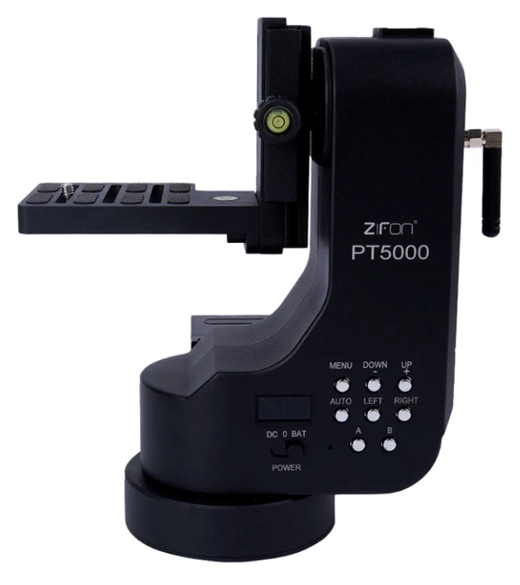
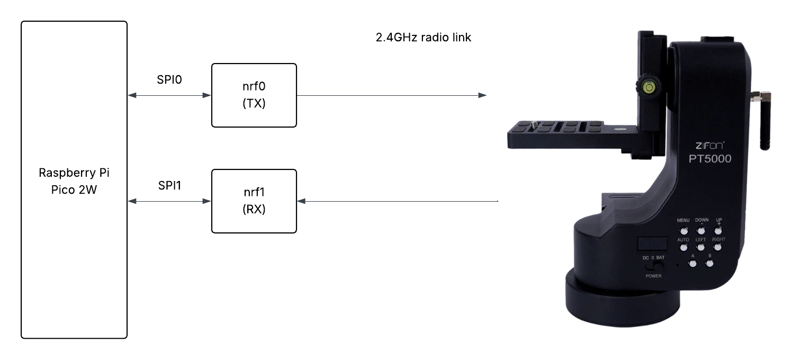

# zifon_pt5000

Documentation of the radio protocol used by the Zifon PT5000 camera gimbal and other useful information pertaining to this device.

> [!IMPORTANT]  
> This is preliminary information which may change as I gain more experience with this device. 

## Background

I purchased this device for a research and development project which required a platform which allowed a camera and sensors to be mounted on a tripod and rotated around 360° and tilted up/down.

## Summary of findings

### Status

As of 2025-04-29 I can successfully 'snoop' on packets sent from the remote control unit to the gimbal and vice versa while on the default channel 2. I can decode the joystick deflection on the remote control unit and the current gimbal angles from the gimbal unit. 

I also have a Micropyton script running an a Raspberry Pi Pico 2W with connected *two* nRF24L01+ radio modules which can command the gimbal to any arbitrary azimuth or elevation angle.
The reason for two radios is that I have not yet been able to configure the nRF24L01+ modules to send a joystick command and receive the angles back. The work-around is to transmit with one radio and listen with another. New script which accepts commands over a WiFi connection. Radio to gimbal communication is still unreliable which, best I can tell, is related to EnhancedShockBurst radio state management, not helped for the fact the 'official' Micropython nRF24L01 library does not support it directly.

### Radio settings
The radio protocol is based on the nRF24L01+ radio module (it's actually a Si24R1 which is a clone). It defaults to frequency channel 80 (2.480GHz). The 5 byte address is 0x52560c0702 (transmitted as little endian with 0x02 first). The symbol rate is 1Mbps, packet payload length is 10 bytes (excluding 9 bit header). 2 byte checksums are used.

### Radio packets 

> [!NOTE]
> Note: depending on which nRF24L01 library you use, you may have to deal with the 9 bit (yes, 9 bits!!) nRF24L01+ header yourself. That will involve stripping the first byte and shifting everything by one bit.

|                                                    | 0    | 1    | 2    | 3    | 4     | 5     | 6    | 7     | 8     | 9     |
|----------------------------------------------------|------|------|------|------|-------|-------|------|-------|-------|-------|
|Controller to gimbal: ping? / nop                   | 0x02 | 0    | 0    |  0   | 0     | 0     | 0    |  0    | 0     | 0     |
|Controller to gimbal: elevation micro-increment *   | 0x02 | 0x11 | 0    | 0    | 0     | 0     | 0    | 0     | 0     | 0     |
|Controller to gimbal: elevation micro-decrement *   | 0x02 | 0x13 | 0    | 0    | 0     | 0     | 0    | 0     | 0     | 0     |
|Controller to gimbal: azimuth micro-increment   *   | 0x02 | 0x15 | 0x00 | 0x00 | 0x00  | 0x00  | 0x00 | 0x00  | 0x00  | 0x00  |
|Controller to gimbal: azimuth micro-decrement   *   | 0x02 | 0x17 | 0x00 | 0x00 | 0x00  | 0x00  | 0x00 | 0x00  | 0x00  | 0x00  |
|Controller to gimbal: photo key                     | 0x02 | 0x19 | 0x00 | 0x00 | 0x00  | 0x00  | 0x00 | 0x00  | 0x00  | 0x00  |
|Controller to gimbal: V key press                   | 0x02 | 0x1B | ?hs? | ?vs? | 0x00  | 0x00  | 0x00 | 0x00  | 0x00  | 0x00  |
|Controller to gimbal: H key press                   | 0x02 | 0x1D | ?hs? | ?vs? | 0x00  | 0x00  | 0x00 | 0x00  | 0x00  | 0x00  |
|Controller to gimbal: continuous scan up/down/up    | 0x02 | 0x1F | 0x00 | 0x00 | 0x00  | 0x00  | 0x00 | 0x00  | 0x00  | 0x00  |
|Controller to gimbal: continuous scan up/down/up    | 0x02 | 0x21 | 0x00 | 0x00 | 0x00  | 0x00  | 0x00 | 0x00  | 0x00  | 0x00  |
|Controller to gimbal: continuous scan anti-clockwise| 0x02 | 0x23 | 0x00 | 0x00 | 0x00  | 0x00  | 0x00 | 0x00  | 0x00  | 0x00  |
|Controller to gimbal: continuous scan      clockwise| 0x02 | 0x25 | 0x00 | 0x00 | 0x00  | 0x00  | 0x00 | 0x00  | 0x00  | 0x00  |
|Controller to gimbal: Auto+A key press (goto A)     | 0x02 | 0x29 | 0x00 | 0x00 | 0x00  | 0x00  | 0x00 | 0x00  | 0x00  | 0x00  |
|Controller to gimbal: Auto+B key press (goto B)     | 0x02 | 0x2B | 0x00 | 0x00 | 0x00  | 0x00  | 0x00 | 0x00  | 0x00  | 0x00  |
|Controller to gimbal: Auto+S key press (scan A↔B)   | 0x02 | 0x2D | 0x00 | 0x00 | 0x00  | 0x00  | 0x00 | 0x00  | 0x00  | 0x00  |
|Controller to gimbal: A key press                   | 0x02 | 0x2F | 0x00 | 0x00 | 0x00  | 0x00  | 0x00 | 0x00  | 0x00  | 0x00  |
|Controller to gimbal: B key press                   | 0x02 | 0x31 | 0x00 | 0x00 | 0x00  | 0x00  | 0x00 | 0x00  | 0x00  | 0x00  |
|Controller to gimbal: S key press (stop)            | 0x02 | 0x33 | 0x00 | 0x00 | 0x00  | 0x00  | 0x00 | 0x00  | 0x00  | 0x00  |
|Gimbal to controller: report gimbal angles          | 0x02 | 0x37 | bat0?| bat1?| aza0  | aza1  | aza2 | ela0  | ela1  | ela2  |
|Controller to gimbal: joystick                      | 0x02 | 0x3f | 0x00 | 0x00 | jxm   | jym   | jxd  | jyd   | 0x00  | 0x00  |
|Controller to gimbal: Auto+joystick                 | 0x02 | 0x41 | 0x00 | 0x00 | 0x00  | 0x00  | ajlr | ajdu  | 0x00  | 0x00  |
|Controller to gimbal: Set A to current angles       | 0x02 | 0x43 | 0x00 | 0x00 | 0x00  | 0x00  | 0x00 | 0x00  | 0x00  | 0x00  |
|Controller to gimbal: Set B to current angles       | 0x02 | 0x44 | 0x00 | 0x00 | 0x00  | 0x00  | 0x00 | 0x00  | 0x00  | 0x00  |

Table of known packet types. All packets 10 bytes of payload (index 0 - 9).  * Commands discovered by experimentation: not observed being transmitted by the controller.

aza{n}: azimuth angle where azimuth_degrees = 360 * (aza0 + aza1 * 256 + aza2 * 65536) / 262144 ;
ela{n}: elevation angle where elevation_degrees = 360 * (aza0 + aza1 * 256 + aza2 * 65536) / 262144 ;
jxm: joystick x-axis deflection magnitude (1 - 8) ;
jxd: joystick x-axis direction of deflection: 0x17 for joystick left or 0x15 for joystick right or ;
jym: joystick y-axis deflection magnitude (1 - 8) ;
jyd: joystick y-axis direction of deflection: 0x13 for joystick down or 0x11 for joystick up ;
hs : horizontal speed; vs : vertical speed ;

ajlr: 0x25 when auto+joystick_left, 0x23 when auto+joystick_right ;
ajdu: 0x21 when auto+joystick_down, 0x1f when auto+joystick_up ;

The continuous scan commands (0x1f, 0x21, 0x23, 0x25) operate at the currently set gimbal azimuth / elevation speed which can be set by commands 0x1b, 0x1d. It is possible to set speeds while the continuous scan is in operation.

For commands 0x23, 0x25, the direction 'clockwise' means looking from above down on the gimbal.

The gimbal can be movedi by joystick packets (type 0x3f) which must be sent frequently for smooth motion. From experiment, a delay of more than 3ms between packets will cause juttery motion. It's important that no other controller device or script is running at the same time, else they will intefere with each other resulting in juttery motion.

The gimbal supports quite a few commands, but a goto specified aziumuth and elevation angle command does not seem to be there :-(   This would be super useful.

### Channels

The PT5000 implements the concept of channels, allowing multiple gimbals and remote controls to operate in the same space. 
The PT5000 comes preconfigured to use channel 2. It is unclear how this is implemented. The documenation here assumes
that the gimbal is set to channel 2.

I had assumed byte index 0 of all the packets was the virtual channel number and that all packets would be transmitted
on the same frequency with the same address. However experiments have ruled this out. It's something else (possibly involving
different addresses, and maybe frequencies).

## Remote control hardware and software

See [here](/micropython/README.md) for more information.

## Other Zifon gimbal products

A search of the US FCC (Federal Communications Commission) for 'Zifon' hints that most of their products are identical. Internal photos of the YT1500 controller on the FCC site also features a Si24R1 chip. So it is likely this documentation and software will work with other Zifon gimbal products. 

However I know for a fact that it will not work with the YT1000 which is based on the JDY-40 radio module. See https://github.com/featherbear/zifon-yt1000-wifi-acu for information on that gimbal.

## Glossary / terminology

I am using the term 'azimuth' as an alternative to the word 'pan', and 'elevation' as an alternative to 'tilt'.
In the code I've abbreviated azimuth as 'az' and elevation as 'el'.

## Open questions / help

Some items I have not yet solved:
* It would be nice to get this working with one nRF24L01+ module (using EnhancedShockBurst features).
* I still can't find where the gimbal battery status is communicated back to the controller
* I would have thought there was a 'go to gimbal azimuth/elevation angle' command, which would eliminate the need for lots of frequent joystick commands. Maybe it's there (?), but I haven't found it. To go to a specific gimbal azimuth/elevation angle issue joystick commands in a tight loop monitoring the returned gimbal angles.
* The gimbal is preconfigured to "channel 2". It's unclear how other channels work.
* I'd like to know more about the internals of the gimbal, but right now I don't have time to tear it down. Replacing its MCU with my own MCU (eg Raspberry Pi Pico) might be useful, but that will probably mean losing functions of the buttons and display.

## Related documents
 * [US FCC approval application by Zifon for YT1500 controller](https://apps.fcc.gov/oetcf/eas/reports/GenericSearch.cfm) Enter 'Zifon' for the 'Applicant' field in the search engine. Sorry, deep links into this database don't seem to be allowed. Observation it seems to use the same radio module as as PT5000.
